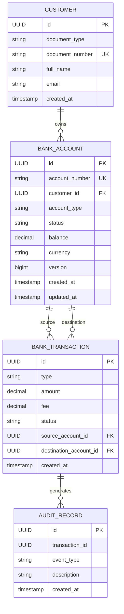
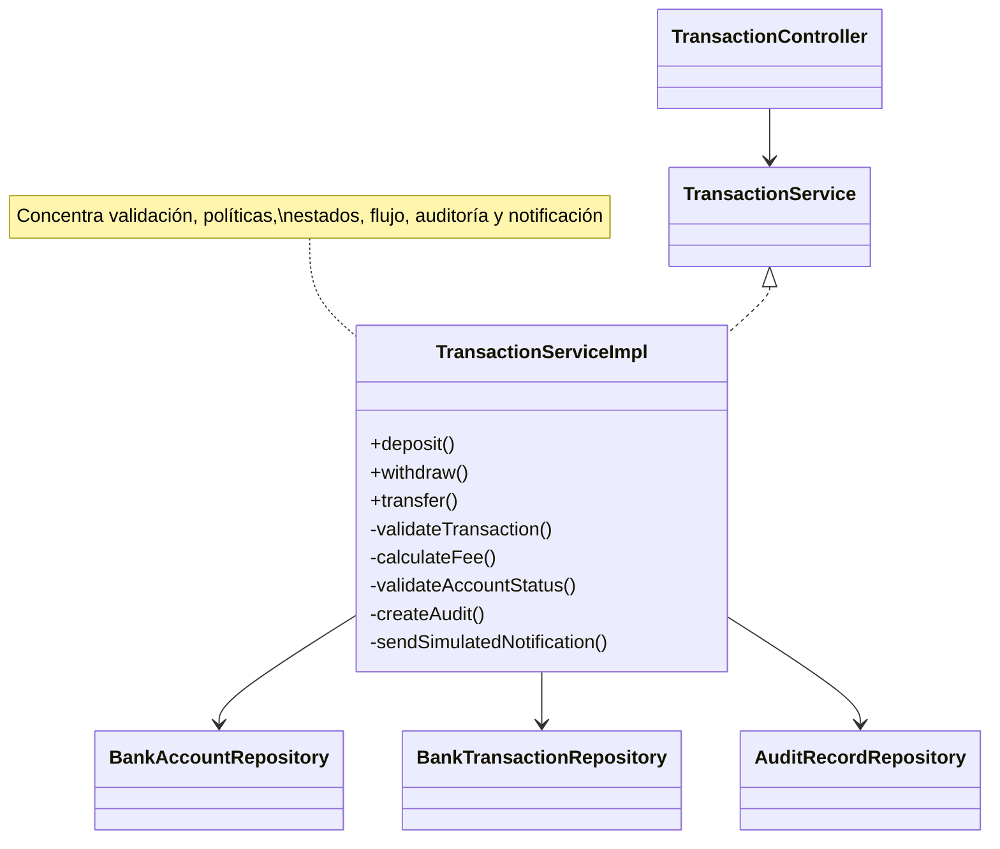
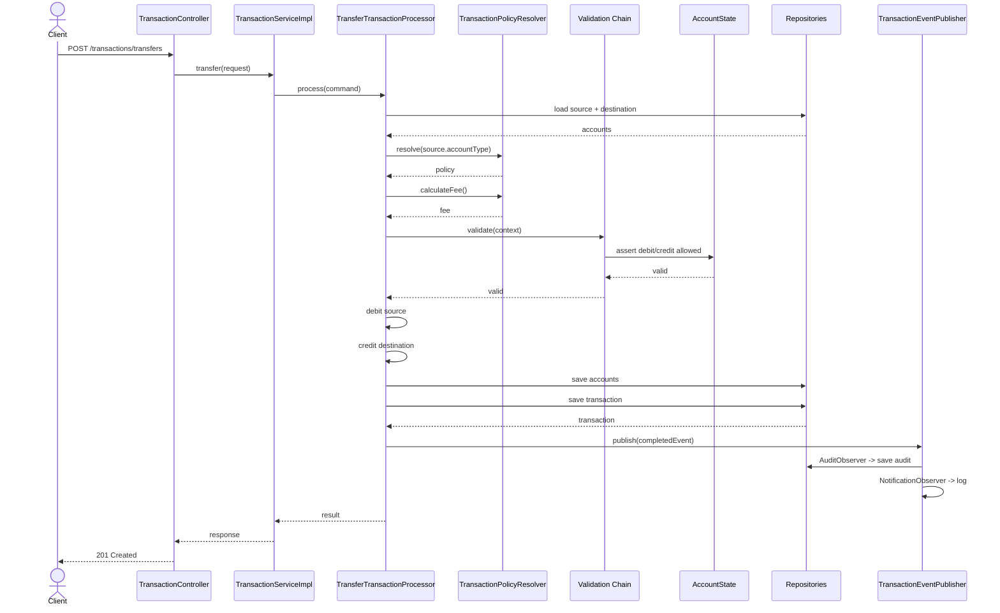

# Diseño — Proyecto Integrador de Diseño Orientado a Objetos

> Estado: **Borrador para revisión — Fase 2 de 3**
>
> Documento dependiente de:
>
> 1. `docs/rubricas/proyecto.md`
> 2. `requerimientos.md` — **APROBADO**
>
> `tareas.md` no debe elaborarse hasta que este diseño haya sido revisado,
> refinado y aprobado.

---

## 1. Propósito del diseño

Este documento define **cómo** se construirá el Core Bancario especificado en
`requerimientos.md`.

El diseño persigue simultáneamente cuatro objetivos:

1. Mantener un proyecto académico pequeño, ejecutable y fácil de explicar.
2. Conservar paridad funcional entre `legacy/` y `refactor/`.
3. Crear problemas de diseño realistas y verificables en `legacy/`.
4. Resolver cada problema mediante exactamente uno de los cinco patrones GoF
   principales definidos para `refactor/`.

La intención no es construir un Core Bancario de producción ni una arquitectura
empresarial compleja. El diseño se limita a lo necesario para demostrar orientación a
objetos, SOLID, refactorización y patrones de diseño con evidencia reproducible.

---

## 2. Decisiones arquitectónicas principales

### D-01. Dos aplicaciones Spring Boot independientes

Se construirán dos aplicaciones:

```text
legacy/
refactor/
```

Cada carpeta será un proyecto Maven/Spring Boot independiente.

Ambos proyectos usarán:

- Java 21.
- Spring Boot 4.1.1.
- Maven Wrapper.
- Lombok.
- Spring Web.
- Spring Data JPA.
- Bean Validation.
- PostgreSQL.
- Flyway.
- Spring Boot Test.
- JUnit 5.
- Mockito.

La API pública será equivalente.

### D-02. Arquitectura MVC por capas

Las dos versiones conservarán la misma arquitectura base:

```text
Controller
    ↓
Service / Interfaces
    ↓
Repository
    ↓
PostgreSQL
```

Los DTO serán la frontera HTTP y las entidades JPA no se expondrán directamente.

`refactor/` añadirá componentes orientados a patrones entre el servicio y el dominio,
sin convertir el proyecto en arquitectura hexagonal, clean architecture ni
microservicios.

### D-03. Mismo dominio, distinto diseño interno

Las dos versiones implementarán las mismas operaciones:

- Clientes.
- Cuentas.
- Consulta de saldo.
- Cambio de estado.
- Consignación.
- Retiro.
- Transferencia.
- Historial de transacciones.

El código `legacy` funcionará, pero tendrá problemas reales de extensibilidad,
duplicación y acoplamiento.

`refactor` deberá producir resultados funcionalmente equivalentes con una estructura
más desacoplada.

### D-04. Exactamente cinco patrones principales

Los patrones oficiales de la entrega serán:

1. Strategy.
2. State.
3. Chain of Responsibility.
4. Template Method.
5. Observer.

No se presentará ningún mecanismo auxiliar como un sexto patrón.

Por ejemplo:

- Los `Mapper` serán solo componentes de conversión.
- Los `Resolver` serán mecanismos de selección.
- La inyección de dependencias de Spring no se presentará como patrón GoF.
- Lombok `@Builder`, si llegara a utilizarse, no se presentará como Builder.
- Los repositories de Spring Data no formarán parte de los cinco patrones evaluados.

---

## 3. Nombre técnico del proyecto

Nombre funcional:

**Core Banking Refactoring Lab**

Artifacts Maven:

```text
legacy:
  groupId: com.unimagdalena
  artifactId: core-banking-legacy

refactor:
  groupId: com.unimagdalena
  artifactId: core-banking-refactor
```

Package raíz para ambas versiones:

```text
com.unimagdalena.corebanking
```

Usar el mismo package raíz facilita la comparación archivo contra archivo.

---

## 4. Estructura física general

```text
entregas/jeison_cabarcas/proyecto/
├── legacy/
│   ├── src/
│   ├── Dockerfile
│   ├── compose.yaml
│   ├── mvnw
│   ├── mvnw.cmd
│   └── pom.xml
│
├── refactor/
│   ├── src/
│   ├── Dockerfile
│   ├── compose.yaml
│   ├── mvnw
│   ├── mvnw.cmd
│   └── pom.xml
│
├── docs/
│   ├── api/
│   │   └── core-banking.http
│   ├── refactor/
│   │   ├── diagnostico.md
│   │   └── matriz-antes-despues.md
│   ├── README-REFACTORIZACION.md
│   └── SUSTENTACION.md
│
├── README.md
├── requerimientos.md
├── diseño.md
└── tareas.md
```

---

# PARTE I — DISEÑO FUNCIONAL COMÚN

## 5. Modelo de dominio

El modelo será deliberadamente pequeño.

Entidades persistentes:

1. `Customer`
2. `BankAccount`
3. `BankTransaction`
4. `AuditRecord`

### 5.1 Customer

Responsabilidad:

Representar un cliente propietario de una o más cuentas.

Campos:

| Campo | Tipo | Regla |
|---|---|---|
| `id` | `UUID` | PK |
| `documentType` | `DocumentType` | obligatorio |
| `documentNumber` | `String` | obligatorio y único |
| `fullName` | `String` | obligatorio |
| `email` | `String` | obligatorio, formato email |
| `createdAt` | `Instant` | generado al crear |

Tipos de documento:

```text
CC
CE
PASSPORT
```

No se modelarán direcciones, teléfonos, KYC ni información adicional.

### 5.2 BankAccount

Responsabilidad:

Representar una cuenta del Core Bancario.

Campos:

| Campo | Tipo | Regla |
|---|---|---|
| `id` | `UUID` | PK |
| `accountNumber` | `String` | único |
| `customer` | `Customer` | ManyToOne obligatorio |
| `accountType` | `AccountType` | obligatorio |
| `status` | `AccountStatus` | obligatorio |
| `balance` | `BigDecimal` | `>= 0` |
| `currency` | `String` | siempre `COP` |
| `version` | `Long` | control optimista |
| `createdAt` | `Instant` | obligatorio |
| `updatedAt` | `Instant` | obligatorio |

Tipos:

```text
SAVINGS
CHECKING
```

Estados:

```text
ACTIVE
BLOCKED
CLOSED
```

Estado inicial:

```text
ACTIVE
```

Saldo inicial:

```text
0 COP
```

El `accountNumber` será un identificador de negocio generado de manera determinista
a partir del UUID completo de la cuenta:

```text
ACC-<UUID sin guiones>
```

Ejemplo:

```text
ACC-A31F84D2C9504CE8A0D413670D8AB992
```

Al derivarse del UUID completo conserva su unicidad sin requerir un generador
adicional. El UUID seguirá siendo el identificador técnico utilizado en las URLs.

### 5.3 BankTransaction

Responsabilidad:

Registrar una operación bancaria ejecutada correctamente.

Campos:

| Campo | Tipo | Regla |
|---|---|---|
| `id` | `UUID` | PK |
| `type` | `TransactionType` | obligatorio |
| `amount` | `BigDecimal` | `> 0` |
| `fee` | `BigDecimal` | `>= 0` |
| `status` | `TransactionStatus` | obligatorio |
| `sourceAccount` | `BankAccount?` | depende del tipo |
| `destinationAccount` | `BankAccount?` | depende del tipo |
| `createdAt` | `Instant` | obligatorio |

Tipos:

```text
DEPOSIT
WITHDRAWAL
TRANSFER
```

Estado persistido inicialmente:

```text
COMPLETED
```

Las solicitudes rechazadas por reglas de negocio no se registrarán como
`BankTransaction`.

Esto evita introducir transacciones independientes únicamente para persistir errores y
mantiene pequeño el alcance académico.

Convención por operación:

| Operación | sourceAccount | destinationAccount |
|---|---|---|
| Deposit | `null` | cuenta receptora |
| Withdrawal | cuenta debitada | `null` |
| Transfer | cuenta origen | cuenta destino |

### 5.4 AuditRecord

Responsabilidad:

Proporcionar evidencia observable para el patrón Observer.

Campos:

| Campo | Tipo |
|---|---|
| `id` | `UUID` |
| `transaction` | `BankTransaction` | ManyToOne obligatorio |
| `eventType` | `String` | tipo de evento |
| `description` | `String` | descripción técnica |
| `createdAt` | `Instant` | fecha del evento |

No será un sistema completo de auditoría.

Su finalidad es demostrar que una acción secundaria puede reaccionar a una
transacción sin acoplarse directamente al procesador principal.

---

## 6. Relaciones JPA



### 6.1 Consideraciones JPA

- `EnumType.STRING` para todos los enums.
- `BigDecimal` con escala 2.
- Las relaciones de transacción hacia cuentas serán `LAZY`.
- No usar cascadas amplias sobre transacciones.
- No serializar entidades directamente.
- La creación de UUID se realizará en aplicación.
- Las restricciones importantes existirán también en base de datos.

---

## 7. Reglas de negocio exactas

Estas reglas serán iguales en `legacy` y `refactor`.

### RN-01. Cliente único

No se puede crear más de un cliente con el mismo:

```text
documentNumber
```

Resultado:

```text
409 CONFLICT
CUSTOMER_DOCUMENT_ALREADY_EXISTS
```

### RN-02. Creación de cuenta

Una cuenta:

- debe pertenecer a un cliente existente;
- inicia en `ACTIVE`;
- inicia con saldo `0.00`;
- usa moneda `COP`.

### RN-03. Consignación

Requisitos:

- monto `> 0`;
- cuenta existente;
- cuenta capaz de recibir créditos.

Comportamiento por estado:

| Estado | Puede recibir depósito |
|---|---|
| ACTIVE | Sí |
| BLOCKED | Sí |
| CLOSED | No |

La consignación no cobra comisión.

### RN-04. Retiro

Requisitos:

- monto `> 0`;
- cuenta existente;
- cuenta `ACTIVE`;
- no exceder límite por operación;
- saldo suficiente para `amount + fee`.

### RN-05. Transferencia

Requisitos:

- monto `> 0`;
- origen existente;
- destino existente;
- origen distinto del destino;
- origen capaz de ser debitado;
- destino capaz de recibir crédito;
- no exceder límite del origen;
- saldo origen suficiente para `amount + fee`.

Movimiento:

```text
source.balance -= amount + fee
destination.balance += amount
```

La comisión no se acredita en otra cuenta porque el proyecto no modelará contabilidad
bancaria completa.

### RN-06. Atomicidad

La transferencia será ejecutada dentro de una transacción de base de datos.

Si falla cualquier paso:

- no se actualiza el saldo origen;
- no se actualiza el saldo destino;
- no se persiste `BankTransaction`;
- no se genera `AuditRecord`.

### RN-07. Políticas por tipo de cuenta

#### SAVINGS

| Operación | Comisión |
|---|---:|
| DEPOSIT | 0 COP |
| WITHDRAWAL | 0 COP |
| TRANSFER | 1.000 COP |

Máximo de débito por operación:

```text
5.000.000 COP
```

#### CHECKING

| Operación | Comisión |
|---|---:|
| DEPOSIT | 0 COP |
| WITHDRAWAL | 2.000 COP |
| TRANSFER | 1.500 COP |

Máximo de débito por operación:

```text
10.000.000 COP
```

Estas tarifas son únicamente académicas.

### RN-08. Transiciones de estado

Transiciones válidas:

```text
ACTIVE  -> BLOCKED
ACTIVE  -> CLOSED
BLOCKED -> ACTIVE
BLOCKED -> CLOSED
```

Transiciones inválidas:

```text
CLOSED -> ACTIVE
CLOSED -> BLOCKED
CLOSED -> CLOSED
```

También se rechazarán cambios al mismo estado cuando no representen una transición.

---

## 8. API REST

Base path:

```text
/api/v1
```

Los contratos serán iguales en las dos versiones.

### 8.1 Clientes

#### Crear cliente

```http
POST /api/v1/customers
```

Request:

```json
{
  "documentType": "CC",
  "documentNumber": "1234567890",
  "fullName": "Ada Lovelace",
  "email": "ada@example.com"
}
```

Respuesta:

```text
201 CREATED
```

#### Consultar cliente

```http
GET /api/v1/customers/{customerId}
```

Respuesta:

```text
200 OK
```

#### Listar clientes

```http
GET /api/v1/customers
```

Respuesta:

```text
200 OK
```

No se implementará paginación para evitar alcance innecesario.

### 8.2 Cuentas

#### Crear cuenta

```http
POST /api/v1/customers/{customerId}/accounts
```

Request:

```json
{
  "accountType": "SAVINGS"
}
```

Respuesta:

```text
201 CREATED
```

#### Consultar cuenta

```http
GET /api/v1/accounts/{accountId}
```

#### Listar cuentas de cliente

```http
GET /api/v1/customers/{customerId}/accounts
```

#### Consultar saldo

```http
GET /api/v1/accounts/{accountId}/balance
```

#### Cambiar estado

```http
PATCH /api/v1/accounts/{accountId}/status
```

Request:

```json
{
  "status": "BLOCKED"
}
```

### 8.3 Transacciones

#### Consignación

```http
POST /api/v1/transactions/deposits
```

Request:

```json
{
  "accountId": "UUID",
  "amount": 100000.00
}
```

#### Retiro

```http
POST /api/v1/transactions/withdrawals
```

Request:

```json
{
  "accountId": "UUID",
  "amount": 50000.00
}
```

#### Transferencia

```http
POST /api/v1/transactions/transfers
```

Request:

```json
{
  "sourceAccountId": "UUID",
  "destinationAccountId": "UUID",
  "amount": 75000.00
}
```

#### Historial

```http
GET /api/v1/accounts/{accountId}/transactions
```

Orden:

```text
createdAt DESC
```

---

## 9. Contratos DTO

### Requests

```text
CreateCustomerRequest
CreateAccountRequest
UpdateAccountStatusRequest
DepositRequest
WithdrawalRequest
TransferRequest
```

### Responses

```text
CustomerResponse
AccountResponse
BalanceResponse
TransactionResponse
ApiErrorResponse
FieldValidationError
```

### 9.1 CreateCustomerRequest

```text
documentType: DocumentType     @NotNull
documentNumber: String         @NotBlank
fullName: String               @NotBlank
email: String                  @NotBlank @Email
```

### 9.2 CreateAccountRequest

```text
accountType: AccountType       @NotNull
```

### 9.3 UpdateAccountStatusRequest

```text
status: AccountStatus          @NotNull
```

### 9.4 DepositRequest

```text
accountId: UUID                @NotNull
amount: BigDecimal             @NotNull @DecimalMin("0.01") @Digits(integer=17, fraction=2)
```

### 9.5 WithdrawalRequest

```text
accountId: UUID                @NotNull
amount: BigDecimal             @NotNull @DecimalMin("0.01") @Digits(integer=17, fraction=2)
```

### 9.6 TransferRequest

```text
sourceAccountId: UUID          @NotNull
destinationAccountId: UUID     @NotNull
amount: BigDecimal             @NotNull @DecimalMin("0.01") @Digits(integer=17, fraction=2)
```

### 9.7 TransactionResponse

Campos:

```text
id
type
amount
fee
status
sourceAccountId
destinationAccountId
createdAt
```

---

## 10. Respuesta de error estándar

Formato:

```json
{
  "timestamp": "2026-09-11T20:00:00Z",
  "status": 422,
  "error": "Unprocessable Entity",
  "code": "INSUFFICIENT_FUNDS",
  "message": "The source account does not have enough available balance",
  "path": "/api/v1/transactions/transfers",
  "details": []
}
```

### 10.1 Mapeo HTTP

| Situación | HTTP | code |
|---|---:|---|
| DTO inválido | 400 | `VALIDATION_ERROR` |
| Cliente no existe | 404 | `CUSTOMER_NOT_FOUND` |
| Cuenta no existe | 404 | `ACCOUNT_NOT_FOUND` |
| Documento duplicado | 409 | `CUSTOMER_DOCUMENT_ALREADY_EXISTS` |
| Cuenta cerrada | 422 | `ACCOUNT_CLOSED` |
| Cuenta bloqueada para débito | 422 | `ACCOUNT_BLOCKED` |
| Fondos insuficientes | 422 | `INSUFFICIENT_FUNDS` |
| Mismo origen/destino | 422 | `SAME_ACCOUNT_TRANSFER` |
| Límite excedido | 422 | `TRANSACTION_LIMIT_EXCEEDED` |
| Transición inválida | 422 | `INVALID_ACCOUNT_STATUS_TRANSITION` |
| Conflicto optimista | 409 | `ACCOUNT_CONCURRENT_UPDATE` |
| Error no controlado | 500 | `INTERNAL_ERROR` |

Se usará:

```text
@RestControllerAdvice
```

para centralizar el mapeo de excepciones.

---

# PARTE II — DISEÑO DE LEGACY

## 11. Objetivo de la versión legacy

`legacy/` debe representar una primera versión técnicamente válida que un estudiante
podría haber construido antes de estudiar patrones de diseño.

Debe cumplir la funcionalidad, pero presentar problemas reconocibles y defendibles.

No se diseñará como código deliberadamente inútil.

Los problemas estarán concentrados principalmente en:

```text
TransactionServiceImpl
AccountServiceImpl
```

Esto facilita la sustentación y evita contaminar todo el proyecto con malas prácticas
innecesarias.

---

## 12. Estructura de paquetes legacy

```text
com.unimagdalena.corebanking
├── CoreBankingApplication.java
├── controller
│   ├── CustomerController.java
│   ├── AccountController.java
│   └── TransactionController.java
├── dto
│   ├── request
│   └── response
├── entity
│   ├── Customer.java
│   ├── BankAccount.java
│   ├── BankTransaction.java
│   └── AuditRecord.java
├── enums
│   ├── DocumentType.java
│   ├── AccountType.java
│   ├── AccountStatus.java
│   ├── TransactionType.java
│   └── TransactionStatus.java
├── exception
│   ├── BusinessException.java
│   ├── ResourceNotFoundException.java
│   └── GlobalExceptionHandler.java
├── mapper
│   ├── CustomerMapper.java
│   ├── AccountMapper.java
│   └── TransactionMapper.java
├── repository
│   ├── CustomerRepository.java
│   ├── BankAccountRepository.java
│   ├── BankTransactionRepository.java
│   └── AuditRecordRepository.java
└── service
    ├── interfaces
    │   ├── CustomerService.java
    │   ├── AccountService.java
    │   └── TransactionService.java
    ├── CustomerServiceImpl.java
    ├── AccountServiceImpl.java
    └── TransactionServiceImpl.java
```

No existirán paquetes de patrones en `legacy`.

---

## 13. Problemas de diseño planificados en legacy

Estos serán los cinco diagnósticos principales.

Las líneas exactas se documentarán en `docs/refactor/diagnostico.md` únicamente
después de implementar y congelar `legacy`.

### LEG-01 — Política de cuenta mediante condicionales

Ubicación esperada:

```text
TransactionServiceImpl
```

Problema:

Método como:

```text
calculateFee(accountType, transactionType, amount)
```

con `if` o `switch` para cada tipo de cuenta.

Consecuencias:

- modificar el servicio para agregar una nueva cuenta;
- lógica de política mezclada con orquestación;
- crecimiento del condicional.

Principios/smells:

```text
OCP
SRP
Switch Statements
```

Solución objetivo:

```text
Strategy
```

### LEG-02 — Comportamiento por estado mediante condicionales repetidos

Ubicaciones esperadas:

```text
TransactionServiceImpl
AccountServiceImpl
```

Problema:

Condiciones repetidas:

```text
if account.status == BLOCKED ...
if account.status == CLOSED ...
```

para decidir:

- débito;
- crédito;
- transición de estado.

Consecuencias:

- reglas distribuidas;
- riesgo de inconsistencias;
- modificación de múltiples métodos cuando cambia un estado.

Principios/smells:

```text
OCP
SRP
Duplicated Conditional
```

Solución objetivo:

```text
State
```

### LEG-03 — Validaciones secuenciales dentro del servicio

Ubicación esperada:

```text
TransactionServiceImpl
```

Problema:

Bloque extenso de validaciones mediante múltiples `if`:

- monto;
- misma cuenta;
- estado;
- límite;
- saldo.

Consecuencias:

- método largo;
- difícil probar validaciones individualmente;
- agregar una regla exige modificar el servicio.

Principios/smells:

```text
SRP
OCP
Long Method
```

Solución objetivo:

```text
Chain of Responsibility
```

### LEG-04 — Duplicación entre deposit, withdraw y transfer

Ubicación esperada:

```text
TransactionServiceImpl
```

Problema:

Los tres métodos repetirán una estructura similar:

1. buscar cuentas;
2. validar;
3. calcular costo;
4. modificar saldo;
5. persistir;
6. auditar/notificar;
7. mapear respuesta.

Consecuencias:

- lógica repetida;
- correcciones replicadas;
- flujo difícil de estandarizar.

Principios/smells:

```text
SRP
OCP
Duplicated Code
```

Solución objetivo:

```text
Template Method
```

### LEG-05 — Efectos secundarios acoplados a la transacción

Ubicación esperada:

```text
TransactionServiceImpl
```

Problema:

Después de persistir una transacción, el servicio ejecutará directamente:

- persistencia de auditoría;
- log de notificación simulada.

Consecuencias:

- más responsabilidades;
- nuevas acciones posteriores obligan a modificar el servicio;
- acoplamiento del flujo principal con efectos secundarios.

Principios/smells:

```text
SRP
OCP
DIP
High Coupling
```

Solución objetivo:

```text
Observer
```

---

## 14. Regla para congelar legacy

Cuando `legacy`:

- compile;
- levante;
- permita ejecutar el flujo funcional;
- tenga los cinco problemas identificados;

se deberá:

1. ejecutar pruebas/smoke tests;
2. registrar el estado en Git;
3. crear tag recomendado `v1-legacy`;
4. generar `docs/refactor/diagnostico.md`;
5. registrar las líneas exactas;
6. no modificar nuevamente el código diagnosticado salvo error de ejecución crítico.

`refactor` se creará a partir de esa funcionalidad congelada.

---

# PARTE III — DISEÑO DE REFACTOR

## 15. Estructura de paquetes refactor

```text
com.unimagdalena.corebanking
├── CoreBankingApplication.java
├── controller
│   ├── CustomerController.java
│   ├── AccountController.java
│   └── TransactionController.java
├── dto
│   ├── request
│   └── response
├── entity
├── enums
├── exception
├── mapper
├── repository
├── service
│   ├── interfaces
│   ├── CustomerServiceImpl.java
│   ├── AccountServiceImpl.java
│   └── TransactionServiceImpl.java
└── pattern
    ├── strategy
    ├── state
    ├── chain
    ├── template
    └── observer
```

El paquete `pattern` se usa intencionalmente para que los patrones sean localizables
durante la evaluación.

No representa una recomendación universal para proyectos empresariales; es una
decisión orientada a claridad académica.

---

# PATRÓN 1 — STRATEGY

## 16. Strategy para políticas de transacción

### 16.1 Problema que resuelve

```text
LEG-01
```

Eliminar condicionales por tipo de cuenta en el cálculo de comisiones y límites.

### 16.2 Roles GoF

Strategy:

```text
AccountTransactionPolicy
```

Concrete Strategies:

```text
SavingsTransactionPolicy
CheckingTransactionPolicy
```

Context/consumer:

```text
AbstractTransactionProcessor
TransactionLimitValidator
```

Selector auxiliar:

```text
TransactionPolicyResolver
```

`TransactionPolicyResolver` no se presentará como Factory.

### 16.3 Contrato

Conceptualmente:

```java
public interface AccountTransactionPolicy {

    AccountType supportedAccountType();

    BigDecimal calculateFee(
        TransactionType transactionType,
        BigDecimal amount
    );

    BigDecimal maxDebitAmount();
}
```

### 16.4 SavingsTransactionPolicy

Reglas:

```text
DEPOSIT     -> 0
WITHDRAWAL  -> 0
TRANSFER    -> 1.000
MAX_DEBIT   -> 5.000.000
```

### 16.5 CheckingTransactionPolicy

Reglas:

```text
DEPOSIT     -> 0
WITHDRAWAL  -> 2.000
TRANSFER    -> 1.500
MAX_DEBIT   -> 10.000.000
```

### 16.6 Selección

`TransactionPolicyResolver` recibirá todas las estrategias mediante constructor:

```text
List<AccountTransactionPolicy>
```

y construirá internamente:

```text
Map<AccountType, AccountTransactionPolicy>
```

No habrá `switch` central por tipo de cuenta.

### 16.7 Por qué Strategy

Se espera poder agregar potencialmente nuevos tipos como:

```text
MONEY_MARKET
PAYROLL
```

sin modificar el procesador de transacciones.

### 16.8 Alternativa descartada

Alternativa:

```text
if / switch dentro de TransactionService
```

Se descarta porque cada nuevo tipo obliga a modificar el servicio.

### 16.9 Trade-off

Se incrementa el número de clases para reglas pequeñas.

Se acepta porque:

- la variación por tipo es explícita;
- las políticas son aislables;
- la selección es extensible;
- el patrón es fácil de defender académicamente.

---

# PATRÓN 2 — STATE

## 17. State para comportamiento de BankAccount

### 17.1 Problema que resuelve

```text
LEG-02
```

Eliminar condicionales distribuidos por estado.

### 17.2 Roles GoF

State:

```text
AccountState
```

Concrete States:

```text
ActiveAccountState
BlockedAccountState
ClosedAccountState
```

Context:

```text
AccountStateContext
```

Selector auxiliar:

```text
AccountStateResolver
```

### 17.3 Contrato conceptual

```java
public interface AccountState {

    AccountStatus status();

    void assertCanDebit();

    void assertCanCredit();

    void assertCanTransitionTo(AccountStatus target);
}
```

### 17.4 ACTIVE

Permite:

```text
debit
credit
ACTIVE -> BLOCKED
ACTIVE -> CLOSED
```

### 17.5 BLOCKED

Permite:

```text
credit
BLOCKED -> ACTIVE
BLOCKED -> CLOSED
```

Rechaza:

```text
debit
```

### 17.6 CLOSED

Rechaza:

```text
debit
credit
cualquier transición
```

### 17.7 Persistencia del estado

JPA persistirá únicamente:

```text
AccountStatus
```

No se persistirá una clase concreta del patrón State.

Al operar:

```text
BankAccount.status
        ↓
AccountStateResolver
        ↓
Concrete AccountState
        ↓
AccountStateContext
```

Esto mantiene el modelo de base de datos sencillo y el comportamiento orientado a
objetos.

### 17.8 Alternativa descartada

Alternativa:

```text
switch(account.getStatus())
```

en cada operación.

Se descarta porque replica reglas y obliga a modificar múltiples zonas al agregar un
estado.

### 17.9 Trade-off

El patrón agrega clases para tres estados sencillos.

Se acepta porque el comportamiento permitido por estado es claramente distinto y el
problema aparece en más de una operación.

---

# PATRÓN 3 — CHAIN OF RESPONSIBILITY

## 18. Chain of Responsibility para validaciones

### 18.1 Problema que resuelve

```text
LEG-03
```

Evitar grandes bloques de validaciones dentro del servicio.

### 18.2 Roles GoF

Handler:

```text
TransactionValidator
```

Base Handler:

```text
AbstractTransactionValidator
```

Concrete Handlers:

```text
PositiveAmountValidator
DifferentAccountsValidator
DebitAccountStateValidator
CreditAccountStateValidator
TransactionLimitValidator
SufficientBalanceValidator
```

Cliente/ensamblador:

```text
TransactionValidationChainProvider
```

### 18.3 Contrato conceptual

```java
public interface TransactionValidator {

    TransactionValidator setNext(TransactionValidator next);

    void validate(TransactionContext context);
}
```

`AbstractTransactionValidator`:

1. ejecuta su regla;
2. si es válida llama al siguiente;
3. si falla lanza `BusinessException`.

### 18.3.1 Ensamblaje seguro de las cadenas

`TransactionValidationChainProvider` construirá una **cadena nueva por operación**.

Los handlers serán objetos Java pequeños y sin estado de negocio compartido. Cuando
un handler necesite colaboradores como `AccountStateResolver` o
`TransactionPolicyResolver`, estos se recibirán por constructor.

No se reutilizará un mismo handler mutable enlazándolo mediante `setNext()` a
diferentes cadenas singleton, porque eso podría modificar la cadena de otra solicitud.

Esta decisión conserva la forma clásica del patrón Chain of Responsibility y evita
problemas de concurrencia.

### 18.4 Cadena DEPOSIT

```text
PositiveAmountValidator
        ↓
CreditAccountStateValidator
```

### 18.5 Cadena WITHDRAWAL

```text
PositiveAmountValidator
        ↓
DebitAccountStateValidator
        ↓
TransactionLimitValidator
        ↓
SufficientBalanceValidator
```

### 18.6 Cadena TRANSFER

```text
PositiveAmountValidator
        ↓
DifferentAccountsValidator
        ↓
DebitAccountStateValidator
        ↓
CreditAccountStateValidator
        ↓
TransactionLimitValidator
        ↓
SufficientBalanceValidator
```

### 18.7 Interacción con State

Los validadores de estado **no duplicarán** condicionales.

Delegarán a:

```text
AccountStateContext
```

Ejemplo conceptual:

```text
DebitAccountStateValidator
       ↓
AccountStateContext.assertCanDebit()
       ↓
Active / Blocked / ClosedAccountState
```

Esto mantiene una responsabilidad diferente:

- Chain decide **qué validaciones ejecutar y en qué orden**.
- State decide **qué comportamiento permite cada estado**.

### 18.8 Interacción con Strategy

`TransactionLimitValidator` obtendrá el límite desde:

```text
AccountTransactionPolicy
```

No contendrá condicionales por tipo de cuenta.

### 18.9 Alternativa descartada

Alternativa:

```text
un método validateTransaction() con múltiples if
```

Se descarta porque:

- crece continuamente;
- no permite probar reglas de forma aislada;
- viola OCP al incorporar nuevas reglas.

### 18.10 Trade-off

El orden de la cadena debe configurarse correctamente.

Esto se mitigará con:

- nombres expresivos;
- `TransactionValidationChainProvider`;
- pruebas unitarias por cadena.

---

# PATRÓN 4 — TEMPLATE METHOD

## 19. Template Method para el ciclo de una transacción

### 19.1 Problema que resuelve

```text
LEG-04
```

Eliminar duplicación estructural entre:

```text
deposit
withdraw
transfer
```

### 19.2 Roles GoF

Abstract Class:

```text
AbstractTransactionProcessor
```

Concrete Classes:

```text
DepositTransactionProcessor
WithdrawalTransactionProcessor
TransferTransactionProcessor
```

Cliente:

```text
TransactionServiceImpl
```

### 19.3 Algoritmo común

Método:

```text
process(command)
```

será `final`.

Secuencia:

```text
1. loadContext(command)
2. resolvePolicy(context)
3. calculateFee(context)
4. validate(context)
5. applyMovement(context)
6. persistTransaction(context)
7. publishCompletedEvent(context)
8. buildResult(context)
```

Los pasos variables serán implementados o extendidos por las subclases.

### 19.4 TransactionCommand

Objeto interno común:

```text
type
sourceAccountId
destinationAccountId
amount
```

Las capas HTTP seguirán usando DTO específicos.

El `TransactionServiceImpl` convertirá:

```text
DepositRequest
WithdrawalRequest
TransferRequest
```

a `TransactionCommand`.

### 19.5 TransactionContext

Objeto de trabajo no persistente.

Campos conceptuales:

```text
TransactionType type
BankAccount sourceAccount
BankAccount destinationAccount
BigDecimal amount
BigDecimal fee
AccountTransactionPolicy policy
BankTransaction savedTransaction
```

No será una entidad JPA.

### 19.6 DepositTransactionProcessor

Responsabilidades específicas:

```text
load destination account
apply:
    destination.balance += amount
```

### 19.7 WithdrawalTransactionProcessor

Responsabilidades específicas:

```text
load source account
apply:
    source.balance -= amount + fee
```

### 19.8 TransferTransactionProcessor

Responsabilidades específicas:

```text
load source
load destination

apply:
    source.balance -= amount + fee
    destination.balance += amount
```

### 19.9 Límite transaccional

Cada llamada pública del `TransactionServiceImpl` será:

```text
@Transactional
```

y delegará al procesador correspondiente.

No se dependerá de self-invocation para iniciar transacciones.

### 19.10 Alternativa descartada

Alternativa:

Tres métodos independientes con pasos copiados.

Se descarta porque:

- el flujo común queda duplicado;
- puede evolucionar de manera inconsistente;
- dificulta introducir un paso transversal.

### 19.11 Trade-off

Template Method usa herencia.

Se acepta porque:

- el algoritmo base es estable;
- las variaciones son pequeñas;
- la jerarquía será de una sola profundidad;
- es fácil visualizar el antes/después.

No se crearán jerarquías adicionales innecesarias.

---

# PATRÓN 5 — OBSERVER

## 20. Observer para eventos posteriores

### 20.1 Problema que resuelve

```text
LEG-05
```

Desacoplar acciones posteriores de la transacción.

### 20.2 Roles GoF

Observer:

```text
TransactionObserver
```

Concrete Observers:

```text
AuditTransactionObserver
NotificationTransactionObserver
```

Subject:

```text
TransactionEventPublisher
```

Evento:

```text
TransactionCompletedEvent
```

### 20.3 Contrato conceptual

```java
public interface TransactionObserver {

    void onTransactionCompleted(TransactionCompletedEvent event);
}
```

### 20.4 TransactionEventPublisher

Recibirá:

```text
List<TransactionObserver>
```

por constructor.

En:

```text
publish(event)
```

recorrerá los observers y notificará el evento.

No habrá dependencias desde los procesadores hacia observers concretos.

### 20.5 AuditTransactionObserver

Acción:

```text
persistir AuditRecord
```

Debe dejar evidencia verificable después de una transacción exitosa.

### 20.6 NotificationTransactionObserver

Acción:

```text
log técnico de una notificación simulada
```

No se enviarán emails ni SMS reales.

### 20.7 Alternativa descartada

Alternativa:

```text
transactionService -> auditRepository
transactionService -> notificationService
```

Se descarta porque agregar una nueva reacción obliga a modificar el flujo principal.

### 20.8 Trade-off

El flujo posterior deja de ser evidente mirando solamente el procesador.

Se mitigará mediante:

- nombres claros;
- diagrama UML;
- pruebas;
- documentación de observers registrados.

---

## 21. Matriz definitiva problema → patrón

| ID | Problema legacy | SOLID / smell | Patrón | Solución refactor |
|---|---|---|---|---|
| LEG-01 | Condicionales por tipo de cuenta | OCP, SRP, Switch Statements | Strategy | `AccountTransactionPolicy` |
| LEG-02 | Condicionales por estado repetidos | OCP, SRP, Duplicated Conditional | State | `AccountState` |
| LEG-03 | Bloque central de validaciones | SRP, OCP, Long Method | Chain of Responsibility | `TransactionValidator` |
| LEG-04 | Flujo duplicado entre operaciones | SRP, OCP, Duplicated Code | Template Method | `AbstractTransactionProcessor` |
| LEG-05 | Auditoría/notificación acopladas | SRP, OCP, DIP, High Coupling | Observer | `TransactionEventPublisher` |

Esta matriz es obligatoria y no debe cambiar durante la implementación sin actualizar
previamente `diseño.md`.

---

## 22. Diagrama UML conceptual — legacy



---

## 23. Diagrama UML conceptual — refactor

```mermaid
classDiagram
    class TransactionService
    class TransactionServiceImpl

    class AbstractTransactionProcessor {
        +process(command) final
    }

    class DepositTransactionProcessor
    class WithdrawalTransactionProcessor
    class TransferTransactionProcessor

    class AccountTransactionPolicy
    class SavingsTransactionPolicy
    class CheckingTransactionPolicy
    class TransactionPolicyResolver

    class AccountState
    class ActiveAccountState
    class BlockedAccountState
    class ClosedAccountState
    class AccountStateContext

    class TransactionValidator
    class AbstractTransactionValidator
    class PositiveAmountValidator
    class DifferentAccountsValidator
    class DebitAccountStateValidator
    class CreditAccountStateValidator
    class TransactionLimitValidator
    class SufficientBalanceValidator

    class TransactionObserver
    class AuditTransactionObserver
    class NotificationTransactionObserver
    class TransactionEventPublisher

    TransactionService <|.. TransactionServiceImpl
    TransactionServiceImpl --> DepositTransactionProcessor
    TransactionServiceImpl --> WithdrawalTransactionProcessor
    TransactionServiceImpl --> TransferTransactionProcessor

    AbstractTransactionProcessor <|-- DepositTransactionProcessor
    AbstractTransactionProcessor <|-- WithdrawalTransactionProcessor
    AbstractTransactionProcessor <|-- TransferTransactionProcessor

    AccountTransactionPolicy <|.. SavingsTransactionPolicy
    AccountTransactionPolicy <|.. CheckingTransactionPolicy
    TransactionPolicyResolver --> AccountTransactionPolicy
    AbstractTransactionProcessor --> TransactionPolicyResolver

    AccountState <|.. ActiveAccountState
    AccountState <|.. BlockedAccountState
    AccountState <|.. ClosedAccountState
    AccountStateContext --> AccountState

    TransactionValidator <|.. AbstractTransactionValidator
    AbstractTransactionValidator <|-- PositiveAmountValidator
    AbstractTransactionValidator <|-- DifferentAccountsValidator
    AbstractTransactionValidator <|-- DebitAccountStateValidator
    AbstractTransactionValidator <|-- CreditAccountStateValidator
    AbstractTransactionValidator <|-- TransactionLimitValidator
    AbstractTransactionValidator <|-- SufficientBalanceValidator

    DebitAccountStateValidator --> AccountStateContext
    CreditAccountStateValidator --> AccountStateContext
    TransactionLimitValidator --> AccountTransactionPolicy

    TransactionObserver <|.. AuditTransactionObserver
    TransactionObserver <|.. NotificationTransactionObserver
    TransactionEventPublisher --> TransactionObserver
    AbstractTransactionProcessor --> TransactionEventPublisher
```



---

## 24. Secuencia de una transferencia refactorizada



---

# PARTE IV — SERVICIOS Y COMPONENTES

## 25. Interfaces de servicio

### CustomerService

```text
create(CreateCustomerRequest)
getById(UUID)
findAll()
```

### AccountService

```text
create(UUID customerId, CreateAccountRequest)
getById(UUID)
findByCustomerId(UUID)
getBalance(UUID)
changeStatus(UUID, UpdateAccountStatusRequest)
```

### TransactionService

```text
deposit(DepositRequest)
withdraw(WithdrawalRequest)
transfer(TransferRequest)
findByAccountId(UUID)
```

Los controllers dependerán de estas interfaces.

---

## 26. Repositories

### CustomerRepository

```text
JpaRepository<Customer, UUID>
existsByDocumentNumber(String)
```

### BankAccountRepository

```text
JpaRepository<BankAccount, UUID>
findAllByCustomerId(UUID)
```

### BankTransactionRepository

Debe permitir consultar transacciones donde una cuenta sea origen o destino.

Método conceptual:

```text
findByAccountIdOrderByCreatedAtDesc(UUID accountId)
```

Puede implementarse mediante:

- método derivado si permanece legible; o
- `@Query` JPQL simple.

### AuditRecordRepository

```text
JpaRepository<AuditRecord, UUID>
```

---

## 27. Mappers

Componentes:

```text
CustomerMapper
AccountMapper
TransactionMapper
```

Responsabilidad exclusiva:

```text
Entity -> Response DTO
```

No contienen lógica bancaria.

Se implementarán manualmente para no introducir MapStruct como dependencia adicional.

Lombok podrá usarse en DTO/entities para getters, constructores y builders cuando
mejore legibilidad.

---

# PARTE V — PERSISTENCIA

## 28. Flyway

Cada proyecto tendrá:

```text
src/main/resources/db/migration/V1__create_core_banking_schema.sql
```

El esquema conceptual deberá ser equivalente entre `legacy` y `refactor`.

Tablas:

```text
customers
bank_accounts
bank_transactions
audit_records
```

### 28.1 Restricciones principales

```text
customers.document_number UNIQUE
bank_accounts.account_number UNIQUE
bank_accounts.balance >= 0
bank_accounts.balance NUMERIC(19,2)
bank_transactions.amount > 0
bank_transactions.amount NUMERIC(19,2)
bank_transactions.fee >= 0
bank_transactions.fee NUMERIC(19,2)
```

### 28.2 Índices

Agregar índices simples sobre:

```text
bank_accounts.customer_id
bank_transactions.source_account_id
bank_transactions.destination_account_id
bank_transactions.created_at
```

---

## 29. Datos iniciales

No se requiere cargar clientes o cuentas automáticamente.

El flujo de demostración se construirá completamente mediante:

```text
docs/api/core-banking.http
```

Esto permite que el profesor observe la creación desde cero.

---

# PARTE VI — CONCURRENCIA Y TRANSACCIONALIDAD

## 30. Control de concurrencia

Para mantener el diseño comprensible se utilizará control optimista mediante:

```text
@Version
```

en:

```text
BankAccount
```

Campo:

```text
version: Long
```

Objetivo:

Evitar actualizaciones silenciosamente perdidas sobre el saldo.

Si se produce conflicto de versión, se devolverá:

```text
409 CONFLICT
ACCOUNT_CONCURRENT_UPDATE
```

No se implementarán locks pesimistas ni sistemas distribuidos de bloqueo.

### 30.1 Justificación

Aunque el objetivo es académico, una transferencia que modifica saldo no debería
diseñarse ignorando completamente concurrencia.

`@Version` aporta una solución pequeña y estándar de JPA sin desviar el proyecto de
su propósito principal.

---

## 31. Límites transaccionales

Operaciones que modifican saldo:

```text
deposit
withdraw
transfer
```

deben ejecutarse dentro de:

```text
@Transactional
```

Especialmente:

```text
transfer
```

debe actualizar:

```text
source
destination
BankTransaction
AuditRecord
```

en una única unidad lógica.

---

# PARTE VII — DOCKER Y EJECUCIÓN

## 32. Puertos

Para permitir ejecutar ambas versiones simultáneamente:

### Legacy

```text
Application:
localhost:8081

PostgreSQL host port:
localhost:5433

Container PostgreSQL:
5432
```

### Refactor

```text
Application:
localhost:8082

PostgreSQL host port:
localhost:5434

Container PostgreSQL:
5432
```

Esto habilita una demo lado a lado.

---

## 33. Docker Compose

Cada carpeta tendrá su propio:

```text
compose.yaml
```

Servicios:

```text
app
postgres
```

Variables conceptuales:

```text
SPRING_DATASOURCE_URL
SPRING_DATASOURCE_USERNAME
SPRING_DATASOURCE_PASSWORD
```

Bases:

```text
legacy:
core_banking_legacy

refactor:
core_banking_refactor
```

No se usarán nombres de contenedor globales fijos si no son necesarios.

De esta forma Docker Compose puede aislar cada proyecto mediante su propio nombre de
proyecto.

---

## 34. Dockerfile

Se usará multi-stage build.

Etapas conceptuales:

```text
1. Maven/Java build
2. JRE runtime
```

Debe:

- compilar el `.jar`;
- copiar únicamente el artefacto ejecutable a runtime;
- exponer el puerto correspondiente;
- arrancar con `java -jar`.

---

## 35. Healthcheck

Se incluirá:

```text
spring-boot-starter-actuator
```

únicamente para:

```text
/actuator/health
```

El healthcheck de Docker verificará disponibilidad.

No se expondrán métricas adicionales ni observabilidad compleja.

---

# PARTE VIII — ESTRATEGIA DE PRUEBAS

## 36. Principio general

La prueba debe ayudar a demostrar la mejora de diseño.

No se busca cobertura porcentual elevada.

### 36.1 Legacy

Pruebas mínimas:

```text
CoreBankingApplicationTests
TransactionServiceImplSmokeTest
```

Objetivo:

Demostrar que el “antes” funciona.

No se invertirán muchas pruebas unitarias en el código que será refactorizado.

### 36.2 Refactor

Pruebas unitarias obligatorias:

```text
SavingsTransactionPolicyTest
CheckingTransactionPolicyTest

ActiveAccountStateTest
BlockedAccountStateTest
ClosedAccountStateTest

TransactionValidationChainTest

DepositTransactionProcessorTest
WithdrawalTransactionProcessorTest
TransferTransactionProcessorTest

TransactionEventPublisherTest
AuditTransactionObserverTest

TransactionServiceImplTest
```

No necesariamente todas deben tener muchos casos.

El foco será cubrir reglas representativas.

### 36.3 Casos mínimos obligatorios

Strategy:

```text
SAVINGS transfer -> fee 1000
CHECKING withdrawal -> fee 2000
```

State:

```text
ACTIVE allows debit
BLOCKED rejects debit
BLOCKED allows credit
CLOSED rejects credit
CLOSED cannot reopen
```

Chain:

```text
transfer valid -> reaches end
same account -> stops
insufficient funds -> stops
```

Template Method:

```text
successful transfer executes common sequence
```

Observer:

```text
publish completed event notifies both observers
```

Transfer service:

```text
success
insufficient balance
```

### 36.4 Integración

Crear al menos:

```text
TransferFlowIntegrationTest
```

Flujo:

1. crear cliente;
2. crear dos cuentas;
3. depositar origen;
4. transferir;
5. consultar saldos;
6. comprobar transacción;
7. comprobar auditoría.

### 36.5 Base de datos de pruebas

Se utilizará:

```text
H2
```

solo con scope de prueba y modo compatible con PostgreSQL cuando sea necesario.

PostgreSQL seguirá siendo la base oficial de ejecución.

El perfil `test` usará:

```text
spring.flyway.enabled=false
spring.jpa.hibernate.ddl-auto=create-drop
```

De esta forma las pruebas unitarias/de integración académicas no dependen de que las
migraciones PostgreSQL sean interpretadas por H2.

La ejecución normal mantendrá:

```text
Flyway habilitado
ddl-auto=validate
```

Esto permite que:

```bash
./mvnw test
```

no requiera Docker.

Si una prueba necesita una característica exclusiva de PostgreSQL, primero se deberá
evaluar si realmente es necesaria para la rúbrica antes de introducir Testcontainers.

---

# PARTE IX — DOCUMENTACIÓN Y EVIDENCIA

## 37. docs/refactor/diagnostico.md

Se creará después de congelar `legacy`.

Formato por problema:

```text
## LEG-01 — Política por tipo de cuenta

Ubicación:
legacy/src/.../TransactionServiceImpl.java:120-148

Problema:
...

Code smell:
...

SOLID:
...

Impacto:
...

Solución:
Strategy

Refactor:
refactor/src/.../AccountTransactionPolicy.java
refactor/src/.../SavingsTransactionPolicy.java
...
```

Las líneas se obtendrán del código real.

Nunca se inventarán antes de implementar.

---

## 38. docs/refactor/matriz-antes-despues.md

Formato:

| ID | Legacy | Problema | SOLID | Patrón | Refactor | Prueba |
|---|---|---|---|---|---|---|
| LEG-01 | archivo:línea | switch por cuenta | OCP | Strategy | clases | test |
| LEG-02 | archivo:línea | estado condicional | OCP/SRP | State | clases | test |
| LEG-03 | archivo:línea | validación monolítica | SRP/OCP | CoR | clases | test |
| LEG-04 | archivo:línea | flujo duplicado | SRP/OCP | Template Method | clases | test |
| LEG-05 | archivo:línea | acciones acopladas | SRP/DIP | Observer | clases | test |

---

## 39. README de refactorización

`docs/README-REFACTORIZACION.md` incluirá:

1. Contexto.
2. Qué representa `legacy`.
3. Qué representa `refactor`.
4. Matriz de diagnóstico.
5. Strategy.
6. State.
7. Chain of Responsibility.
8. Template Method.
9. Observer.
10. UML legacy.
11. UML refactor.
12. Secuencia transferencia.
13. Comparación SOLID.
14. Trade-offs.
15. Resultados de pruebas.
16. Qué se mejoraría en un sistema real.

---

## 40. docs/api/core-banking.http

Usará variables:

```http
@legacyBaseUrl = http://localhost:8081/api/v1
@refactorBaseUrl = http://localhost:8082/api/v1

@baseUrl = {{refactorBaseUrl}}
```

Para comparar, solo se cambia:

```text
@baseUrl
```

Flujo:

```text
1. POST customer
2. POST savings account
3. POST checking account
4. POST deposit
5. POST transfer
6. GET source balance
7. GET destination balance
8. GET history
9. PATCH account BLOCKED
10. intentar withdrawal bloqueado
```

Este último punto es especialmente útil para demostrar `State`.

---

# PARTE X — SUSTENTACIÓN

## 41. Diseño de la demostración de 10–15 minutos

Tiempo orientativo:

```text
1 min  -> problema y objetivo
2 min  -> legacy
6 min  -> cinco problemas y cinco patrones
2 min  -> ejecución API
2 min  -> pruebas y conclusión
```

### 41.1 Orden recomendado

1. Mostrar estructura `legacy`.
2. Abrir `TransactionServiceImpl`.
3. Mostrar un problema concreto con línea.
4. Abrir su equivalente en `refactor`.
5. Explicar el patrón.
6. Explicar alternativa descartada.
7. Repetir de forma breve para los cinco.
8. Ejecutar transferencia.
9. Mostrar saldos.
10. Mostrar audit record.
11. Ejecutar caso bloqueado.
12. Mostrar pruebas.

---

## 42. Preguntas que el diseño debe permitir responder

### Strategy

¿Por qué no usar un `switch`?

Respuesta esperada:

Porque el comportamiento cambia por tipo de cuenta y queremos agregar una política
sin modificar el algoritmo central. Strategy aplica OCP.

### State

¿Por qué no usar un enum con condiciones?

Respuesta esperada:

El enum identifica el estado persistido; las clases State encapsulan comportamiento.
Esto evita distribuir decisiones por estado en varios servicios.

### Chain of Responsibility

¿Por qué no un solo método `validate()`?

Respuesta esperada:

Las reglas cambian independientemente y no todas aplican a cada operación. La cadena
permite componer orden y reglas sin agrandar el servicio.

### Template Method

¿Por qué herencia y no composición?

Respuesta esperada:

Aquí existe un algoritmo común estable con pocos pasos variables. Una jerarquía de un
nivel hace visible el flujo compartido. Si los algoritmos divergieran mucho,
composición sería preferible.

### Observer

¿Por qué no llamar al auditor directamente?

Respuesta esperada:

Porque auditar y notificar no forman parte del cálculo del movimiento. Observer
permite agregar reacciones posteriores sin modificar el procesador.

---

# PARTE XI — COMPARABILIDAD LEGACY / REFACTOR

## 43. Elementos que deben permanecer iguales

Siempre que sea posible:

```text
DTOs
endpoints
HTTP status
entities
enums
migrations
repositorios
reglas funcionales
requests de demostración
```

### 43.1 Elementos que cambiarán

Principalmente:

```text
TransactionServiceImpl
AccountServiceImpl
componentes internos de negocio
pruebas unitarias
paquetes pattern/*
```

El objetivo es que la diferencia observada sea atribuible a diseño, no a un cambio de
producto.

---

## 44. Regla de sincronización

Cuando se detecte un bug funcional común antes de congelar legacy:

```text
corregir en legacy
replicar en refactor cuando exista
```

Después de congelar `legacy`:

- no se harán mejoras de diseño sobre él;
- un bug crítico que impida ejecutar podrá corregirse;
- la corrección deberá documentarse;
- las referencias de línea del diagnóstico deberán actualizarse si cambian.

---

# PARTE XII — DEPENDENCIAS MAVEN

## 45. Dependencias principales

Conceptualmente ambos `pom.xml` incluirán:

```text
spring-boot-starter-web
spring-boot-starter-data-jpa
spring-boot-starter-validation
spring-boot-starter-actuator
postgresql
flyway-core
flyway-database-postgresql
lombok
spring-boot-starter-test
h2 (test)
```

No agregar:

```text
MapStruct
Kafka
RabbitMQ
Redis
Spring Security
OAuth
OpenFeign
WebFlux
Testcontainers
```

salvo modificación aprobada del diseño.

---

# PARTE XIII — LOGGING Y COMENTARIOS

## 46. Logging

Usar SLF4J mediante:

```text
@Slf4j
```

Logs relevantes:

```text
customer created
account created
transaction completed
account status changed
simulated notification
unexpected error
```

No registrar información innecesaria.

No usar:

```text
System.out.println
```

en `refactor`.

En `legacy`, tampoco se introducirá `System.out` como mala práctica artificial; los
problemas legacy se demostrarán mediante diseño, no mediante código grotesco.

---

## 47. Comentarios

Los comentarios se reservarán para decisiones no evidentes.

Ejemplo aceptable:

```java
// The fee is included in the debit because it is charged to the source account.
```

Evitar:

```java
// Get the account
BankAccount account = ...
```

No usar emojis.

---

# PARTE XIV — CRITERIOS DE DISEÑO PARA EL AGENTE IA

## 48. Reglas obligatorias

El agente implementador deberá:

1. Construir primero `legacy`.
2. No crear componentes `pattern/*` dentro de `legacy`.
3. Verificar que `legacy` funciona antes de diagnosticarlo.
4. Registrar las líneas reales de los cinco problemas.
5. Congelar `legacy`.
6. Crear `refactor` manteniendo contratos y comportamiento.
7. Aplicar un patrón a cada problema según la matriz.
8. No sustituir un patrón sin modificar y aprobar primero este documento.
9. No agregar patrones únicamente para demostrar conocimiento.
10. Mantener los roles GoF visibles.
11. Ejecutar pruebas después de cada refactor relevante.
12. Mantener Docker funcional.
13. No declarar una tarea completada sin evidencia de ejecución.
14. No generar líneas ficticias en el diagnóstico.
15. Evitar sobreingeniería.
16. Mantener todas las decisiones explicables para una sustentación oral.

---

## 49. Reglas de implementación del legacy

Legacy debe ser malo **de forma realista**, no caricaturesca.

Permitido:

- método de servicio largo;
- condicionales repetidos;
- duplicación entre operaciones;
- responsabilidades secundarias dentro del servicio;
- lógica difícil de extender.

No permitido:

- código que no compile;
- métodos sin sentido;
- nombres absurdos;
- variables de una letra sin razón;
- errores intencionales;
- eliminar capas MVC;
- SQL inseguro;
- credenciales hardcodeadas;
- malas prácticas ajenas a los patrones evaluados.

---

## 50. Reglas de implementación del refactor

Refactor debe:

- mantener comportamiento;
- tener controllers delgados;
- usar interfaces de servicios;
- usar constructor injection;
- centralizar errores;
- usar DTOs;
- usar `BigDecimal`;
- usar transacciones explícitas;
- mantener entidades pequeñas;
- demostrar correctamente los cinco patrones;
- usar pruebas focalizadas.

---

# PARTE XV — CRITERIOS DE ACEPTACIÓN DEL DISEÑO

## 51. Diseño funcional

El diseño queda correctamente implementado si:

- ambas APIs ofrecen los mismos endpoints;
- las reglas monetarias son iguales;
- los estados se comportan igual;
- las transferencias son atómicas;
- las respuestas equivalentes contienen la misma información.

## 52. Diseño legacy

Debe existir evidencia de:

- LEG-01;
- LEG-02;
- LEG-03;
- LEG-04;
- LEG-05.

Todos deben ser problemas reales y localizables.

## 53. Diseño refactor

Debe demostrarse:

```text
LEG-01 -> Strategy
LEG-02 -> State
LEG-03 -> Chain of Responsibility
LEG-04 -> Template Method
LEG-05 -> Observer
```

## 54. Calidad

Debe cumplirse:

```text
./mvnw test
docker compose up --build
```

según corresponda a cada versión.

## 55. Evidencia académica

Cada patrón debe poder explicarse con:

```text
1. problema original;
2. archivo/línea;
3. principio o smell;
4. patrón elegido;
5. roles del patrón;
6. código refactorizado;
7. alternativa descartada;
8. trade-off;
9. prueba;
10. resultado funcional.
```

---

# PARTE XVI — DECISIONES CERRADAS PARA TAREAS.MD

Una vez aprobado este documento, `tareas.md` debe convertir el diseño en pasos
ejecutables y verificables.

El plan deberá respetar este macro-orden:

```text
1. Preparar estructura raíz.
2. Construir legacy.
3. Probar legacy.
4. Congelar legacy.
5. Crear diagnóstico con archivo:línea.
6. Crear refactor desde la misma base funcional.
7. Refactorizar LEG-01 con Strategy.
8. Refactorizar LEG-02 con State.
9. Refactorizar LEG-03 con Chain of Responsibility.
10. Refactorizar LEG-04 con Template Method.
11. Refactorizar LEG-05 con Observer.
12. Completar pruebas.
13. Verificar paridad.
14. Completar Docker.
15. Completar documentación.
16. Ejecutar validación final de rúbrica.
17. Preparar sustentación.
```

`tareas.md` deberá dividir estos bloques en tareas pequeñas, indicando:

- archivos;
- objetivo;
- dependencias;
- pruebas;
- comandos de verificación;
- criterio de terminado.

No debe comenzar su elaboración hasta la aprobación explícita de este diseño.
