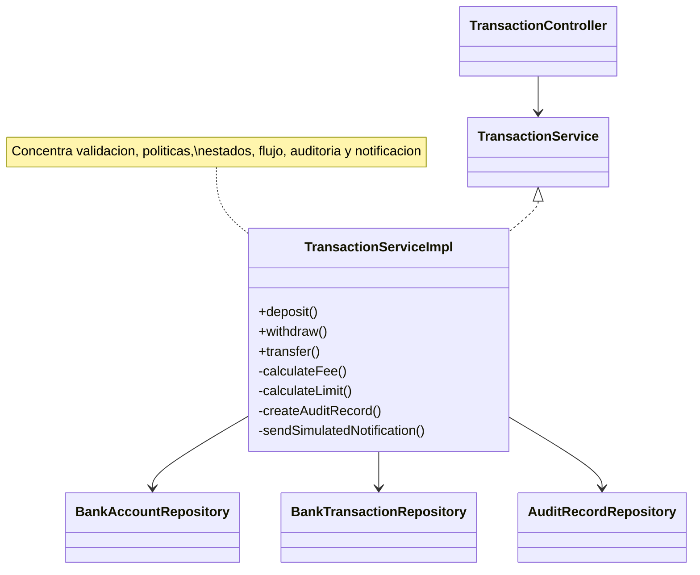
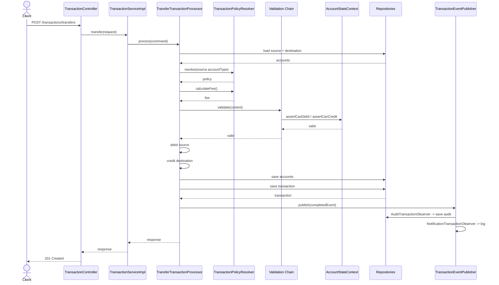

# Arquitectura y refactorización — Core Banking Refactoring Lab

## 1. Contexto

Este proyecto es la Actividad 4 (proyecto integrador) del curso de Especialización en
Desarrollo de Software. Consiste en construir un Core Bancario académico en dos
versiones completas:

- `legacy/`: versión inicial del Core Bancario construida específicamente para
  demostrar el proceso de diagnóstico y refactorización de este proyecto integrador.
  No proviene de un proyecto histórico previo.
- `refactor/`: la misma funcionalidad, refactorizada aplicando exactamente cinco
  patrones de diseño GoF sobre problemas reales y verificables de `legacy`.

El objetivo académico es poder defender, con evidencia de código y pruebas, qué
estaba mal en el código anterior y cómo se solucionó.

## 2. Arquitectura común

Ambas versiones comparten:

- Java 21, Spring Boot 4.1.1, Maven Wrapper.
- Arquitectura MVC por capas: `Controller -> Service/Interfaces -> Repository -> PostgreSQL`.
- El mismo modelo de dominio: `Customer`, `BankAccount`, `BankTransaction`, `AuditRecord`.
- Los mismos DTO, los mismos endpoints REST bajo `/api/v1`, el mismo mapeo de errores
  HTTP y la misma migración Flyway (`V1__create_core_banking_schema.sql`).
- Lombok, Bean Validation, control optimista con `@Version` en `BankAccount`, y
  `BigDecimal` para todo valor monetario.

`refactor/` añade únicamente el paquete `pattern/` (`strategy`, `state`, `chain`,
`template`, `observer`) entre el servicio y el dominio. No se agregó arquitectura
hexagonal, clean architecture ni microservicios.

## 3. Legacy

Los problemas de diseño se concentraron deliberadamente en:

```text
legacy/src/main/java/com/unimagdalena/corebanking/service/TransactionServiceImpl.java
legacy/src/main/java/com/unimagdalena/corebanking/service/AccountServiceImpl.java
```

`legacy` compila, levanta y ejecuta correctamente todas las operaciones del Core
Bancario (10 pruebas, `BUILD SUCCESS`). Sus problemas son de diseño —
extensibilidad, duplicación y acoplamiento— no de funcionalidad rota.

El código quedó congelado en el tag `v1-legacy` una vez verificado y diagnosticado.

## 4. Diagnóstico

Ver `docs/refactor/diagnostico.md` para el detalle completo de los cinco problemas
(LEG-01 a LEG-05) con `archivo:línea` reales, y `docs/refactor/matriz-antes-despues.md`
para la trazabilidad completa problema → patrón → clases → prueba.

Resumen:

| ID | Problema | Patrón |
|---|---|---|
| LEG-01 | `switch` anidado por tipo de cuenta para calcular comisión y límite | Strategy |
| LEG-02 | Condicionales de `AccountStatus` repetidos en cuatro puntos | State |
| LEG-03 | Bloque de siete validaciones secuenciales en `transfer()` | Chain of Responsibility |
| LEG-04 | Estructura de siete pasos duplicada entre `deposit`/`withdraw`/`transfer` | Template Method |
| LEG-05 | Auditoría y notificación invocadas directamente desde el flujo principal | Observer |

## 5. Strategy — políticas de transacción

**Problema (LEG-01):** `TransactionServiceImpl.calculateFee()`/`calculateLimit()`
(líneas 205-242) usaban `switch`/`if` por `AccountType`.

**Por qué se eligió:** el comportamiento de comisión y límite varía por tipo de
cuenta y se espera poder agregar tipos nuevos (`MONEY_MARKET`, `PAYROLL`) sin tocar el
procesador de transacciones.

**Alternativa descartada:** mantener el `switch`/`if` dentro del servicio. Se
descarta porque cada tipo de cuenta nuevo obliga a modificar `TransactionServiceImpl`
directamente, violando OCP.

**Roles GoF:**

- Strategy: `AccountTransactionPolicy`
- Concrete Strategies: `SavingsTransactionPolicy`, `CheckingTransactionPolicy`
- Contexto/selector: `TransactionPolicyResolver` (no se presenta como Factory)

**Clases:** `refactor/src/main/java/com/unimagdalena/corebanking/pattern/strategy/`

**Principio SOLID que mejora:** OCP — agregar una política nueva no exige modificar
código existente, solo registrar un nuevo bean `AccountTransactionPolicy`.

**Trade-off:** una clase adicional por cada tipo de cuenta. Se acepta porque hace la
variación explícita y aislable.

**Prueba:** `SavingsTransactionPolicyTest`, `CheckingTransactionPolicyTest`.

## 6. State — comportamiento de la cuenta

**Problema (LEG-02):** condicionales de `AccountStatus` repetidos en `deposit()`,
`withdraw()`, `transfer()` (`TransactionServiceImpl`) y en `changeStatus()`
(`AccountServiceImpl`).

**Por qué se eligió:** el comportamiento permitido (débito, crédito, transición) es
claramente distinto por estado, y el problema aparecía en más de una operación.

**Alternativa descartada:** un enum con `if`/`switch` repetidos en cada operación. Se
descarta porque replica reglas y obliga a modificar múltiples zonas al agregar un
estado.

**Roles GoF:**

- State: `AccountState`
- Concrete States: `ActiveAccountState`, `BlockedAccountState`, `ClosedAccountState`
- Contexto: `AccountStateContext`
- Selector: `AccountStateResolver`

**Clases:** `refactor/src/main/java/com/unimagdalena/corebanking/pattern/state/`

**Principio SOLID que mejora:** OCP y SRP — la regla de comportamiento por estado
vive en un único lugar por estado, no dispersa en varios servicios.

**Trade-off:** tres clases adicionales para tres estados sencillos. Se acepta porque
el comportamiento permitido por estado es claramente distinto y aparece en más de una
operación.

**Prueba:** `ActiveAccountStateTest`, `BlockedAccountStateTest`, `ClosedAccountStateTest`.

## 7. Chain of Responsibility — validaciones de transacción

**Problema (LEG-03):** `transfer()` concentraba siete validaciones secuenciales en un
único método (líneas 136-172 de `TransactionServiceImpl`).

**Por qué se eligió:** las reglas cambian independientemente y no todas aplican a
cada operación (depósito, retiro, transferencia tienen cadenas distintas).

**Alternativa descartada:** un único método `validateTransaction()` con múltiples
`if`. Se descarta porque crece continuamente, no permite probar reglas de forma
aislada y viola OCP al incorporar nuevas reglas.

**Roles GoF:**

- Handler: `TransactionValidator`
- Base Handler: `AbstractTransactionValidator`
- Concrete Handlers: `PositiveAmountValidator`, `DifferentAccountsValidator`,
  `DebitAccountStateValidator`, `CreditAccountStateValidator`,
  `TransactionLimitValidator`, `SufficientBalanceValidator`
- Ensamblador: `TransactionValidationChainProvider`

**Clases:** `refactor/src/main/java/com/unimagdalena/corebanking/pattern/chain/`

**Decisión de concurrencia:** `TransactionValidationChainProvider` construye una
cadena nueva (`new PositiveAmountValidator()...`) en cada llamada, en lugar de
reutilizar un handler singleton mutado con `setNext()`. Esto evita que una solicitud
modifique la cadena de otra.

**Principio SOLID que mejora:** SRP (cada validador tiene una única regla) y OCP
(agregar una regla nueva no exige tocar las existentes).

**Trade-off:** el orden de la cadena debe configurarse correctamente en el provider.
Se mitiga con nombres expresivos y `TransactionValidationChainTest`.

**Prueba:** `TransactionValidationChainTest`.

## 8. Template Method — flujo de una transacción

**Problema (LEG-04):** `deposit()`, `withdraw()` y `transfer()` repetían la misma
estructura de siete pasos (líneas 49-196 de `TransactionServiceImpl`).

**Por qué se eligió:** existe un algoritmo común estable
(`loadContext -> resolvePolicy -> calculateFee -> validate -> applyMovement ->
persistTransaction -> publishCompletedEvent -> buildResult`) con pocos pasos
variables, y una jerarquía de un nivel hace visible ese flujo compartido.

**Alternativa descartada:** tres métodos independientes con los pasos copiados. Se
descarta porque el flujo común queda duplicado y puede evolucionar de forma
inconsistente.

**Roles GoF:**

- Clase abstracta: `AbstractTransactionProcessor` (`process()` es `final`)
- Clases concretas: `DepositTransactionProcessor`, `WithdrawalTransactionProcessor`,
  `TransferTransactionProcessor`
- Cliente: `TransactionServiceImpl`

**Clases:** `refactor/src/main/java/com/unimagdalena/corebanking/pattern/template/`

**Principio SOLID que mejora:** SRP y OCP — `TransactionServiceImpl` queda reducido a
construir un `TransactionCommand` y delegar; el algoritmo común está protegido de
modificaciones accidentales al ser `final`.

**Trade-off:** usa herencia. Se acepta porque la jerarquía es de un solo nivel y las
variaciones (`applyMovement`, `loadContext`, `selectValidationChain`) son pequeñas.

**Prueba:** `DepositTransactionProcessorTest`, `WithdrawalTransactionProcessorTest`,
`TransferTransactionProcessorTest`.

## 9. Observer — eventos posteriores a la transacción

**Problema (LEG-05):** después de persistir cada `BankTransaction`, el servicio
llamaba directamente a `createAuditRecord()` y `sendSimulatedNotification()` en tres
puntos distintos.

**Por qué se eligió:** auditar y notificar no forman parte del cálculo del
movimiento; Observer permite agregar reacciones posteriores sin modificar el
procesador principal.

**Alternativa descartada:** que el procesador llame directamente a
`auditRepository`/`notificationService`. Se descarta porque agregar una nueva
reacción obligaría a modificar el flujo principal en cada punto de uso.

**Roles GoF:**

- Observer: `TransactionObserver`
- Concrete Observers: `AuditTransactionObserver`, `NotificationTransactionObserver`
- Subject: `TransactionEventPublisher`
- Evento: `TransactionCompletedEvent`

**Clases:** `refactor/src/main/java/com/unimagdalena/corebanking/pattern/observer/`

**Principio SOLID que mejora:** SRP y DIP — `AbstractTransactionProcessor` depende
únicamente de `TransactionEventPublisher`, no de los observadores concretos.

**Trade-off:** el flujo posterior deja de ser evidente mirando solo el procesador. Se
mitiga con nombres claros, este documento y pruebas dedicadas.

**Prueba:** `TransactionEventPublisherTest`, `AuditTransactionObserverTest`.

## 10. Diagrama UML — legacy



## 11. Diagrama UML — refactor

```mermaid
classDiagram
    class TransactionService
    class TransactionServiceImpl

    class AbstractTransactionProcessor {
        +process(command) final
    }

    class DepositTransactionProcessor
    class WithdrawalTransactionProcessor
    class TransferTransactionProcessor

    class AccountTransactionPolicy
    class SavingsTransactionPolicy
    class CheckingTransactionPolicy
    class TransactionPolicyResolver

    class AccountState
    class ActiveAccountState
    class BlockedAccountState
    class ClosedAccountState
    class AccountStateContext

    class TransactionValidator
    class AbstractTransactionValidator
    class PositiveAmountValidator
    class DifferentAccountsValidator
    class DebitAccountStateValidator
    class CreditAccountStateValidator
    class TransactionLimitValidator
    class SufficientBalanceValidator

    class TransactionObserver
    class AuditTransactionObserver
    class NotificationTransactionObserver
    class TransactionEventPublisher

    TransactionService <|.. TransactionServiceImpl
    TransactionServiceImpl --> DepositTransactionProcessor
    TransactionServiceImpl --> WithdrawalTransactionProcessor
    TransactionServiceImpl --> TransferTransactionProcessor

    AbstractTransactionProcessor <|-- DepositTransactionProcessor
    AbstractTransactionProcessor <|-- WithdrawalTransactionProcessor
    AbstractTransactionProcessor <|-- TransferTransactionProcessor

    AccountTransactionPolicy <|.. SavingsTransactionPolicy
    AccountTransactionPolicy <|.. CheckingTransactionPolicy
    TransactionPolicyResolver --> AccountTransactionPolicy
    AbstractTransactionProcessor --> TransactionPolicyResolver

    AccountState <|.. ActiveAccountState
    AccountState <|.. BlockedAccountState
    AccountState <|.. ClosedAccountState
    AccountStateContext --> AccountState

    TransactionValidator <|.. AbstractTransactionValidator
    AbstractTransactionValidator <|-- PositiveAmountValidator
    AbstractTransactionValidator <|-- DifferentAccountsValidator
    AbstractTransactionValidator <|-- DebitAccountStateValidator
    AbstractTransactionValidator <|-- CreditAccountStateValidator
    AbstractTransactionValidator <|-- TransactionLimitValidator
    AbstractTransactionValidator <|-- SufficientBalanceValidator

    DebitAccountStateValidator --> AccountStateContext
    CreditAccountStateValidator --> AccountStateContext
    TransactionLimitValidator --> AccountTransactionPolicy

    TransactionObserver <|.. AuditTransactionObserver
    TransactionObserver <|.. NotificationTransactionObserver
    TransactionEventPublisher --> TransactionObserver
    AbstractTransactionProcessor --> TransactionEventPublisher
```



## 12. Secuencia de una transferencia (refactor)



## 13. Comparación SOLID

| Principio | Legacy | Refactor |
|---|---|---|
| SRP | `TransactionServiceImpl` mezcla validación, políticas, estados, flujo, auditoría y notificación | Cada responsabilidad vive en su propia clase (`AccountTransactionPolicy`, `AccountState`, `TransactionValidator`, `AbstractTransactionProcessor`, `TransactionObserver`) |
| OCP | Agregar un tipo de cuenta, un estado o una validación exige modificar `TransactionServiceImpl` | Agregar cualquiera de esos elementos se hace mediante una clase nueva, sin tocar código existente |
| LSP | No aplica de forma crítica (no hay jerarquías propias) | `AbstractTransactionProcessor`/`AbstractTransactionValidator` respetan el contrato del padre en sus subclases |
| ISP | `TransactionServiceImpl` expone y usa una única interfaz amplia | Interfaces pequeñas y específicas por rol (`AccountTransactionPolicy`, `AccountState`, `TransactionValidator`, `TransactionObserver`) |
| DIP | El servicio depende directamente de `AuditRecordRepository` para una preocupación secundaria | `AbstractTransactionProcessor` depende de la abstracción `TransactionEventPublisher`, no de los observadores concretos |

## 14. Alternativas descartadas

Ver la sección "Alternativa descartada" de cada patrón (secciones 5 a 9). En resumen,
la alternativa descartada en los cinco casos fue mantener o repetir condicionales
(`switch`/`if`) dentro de `TransactionServiceImpl`, lo cual habría mantenido las
violaciones de OCP/SRP diagnosticadas.

## 15. Trade-offs

Ver la sección "Trade-off" de cada patrón (secciones 5 a 9). En conjunto, el
refactor incrementa el número de clases (aproximadamente 30 clases nuevas bajo
`pattern/`) a cambio de aislar responsabilidades, mejorar la testabilidad y evitar
condicionales repetidos. Para un proyecto académico de este tamaño se considera un
costo aceptable y defendible.

## 16. Pruebas

`refactor/` contiene 43 pruebas (`BUILD SUCCESS`), incluyendo:

- Pruebas unitarias por patrón (Strategy, State, Chain of Responsibility, Template
  Method, Observer).
- `TransactionServiceImplTest`: verifica que el servicio delega correctamente en el
  procesador correspondiente.
- `TransferFlowIntegrationTest`: prueba de integración end-to-end (cliente, dos
  cuentas, depósito, transferencia, saldos, auditoría) usando el contexto completo de
  Spring sobre H2, sin requerir Docker.

`legacy/` contiene 10 pruebas (`BUILD SUCCESS`) que demuestran que el "antes"
funciona correctamente.

## 17. Mejoras futuras

Con más tiempo se consideraría:

- Reemplazar el mecanismo de `@Version` optimista por una estrategia de reintento
  automático ante `ACCOUNT_CONCURRENT_UPDATE`.
- Externalizar las tarifas de `SavingsTransactionPolicy`/`CheckingTransactionPolicy`
  a configuración en lugar de constantes en código, si el número de políticas creciera.
- Agregar paginación a los listados de clientes y del historial de transacciones si
  el volumen de datos lo justificara.
- Evaluar un mecanismo de outbox/eventos asíncronos si `TransactionEventPublisher`
  necesitara reacciones que crucen procesos o servicios.
